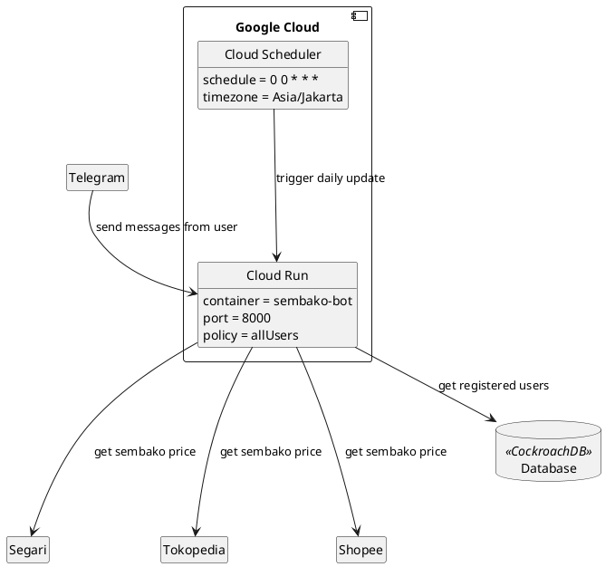

```plantuml

@startuml

skinparam shadowing false
hide empty fields
hide empty methods
hide circle
allowmixing

class Telegram
class Segari
class Tokopedia
class Shopee
database "Database" <<CockroachDB>> as db

component "Google Cloud" {

    class "Cloud Run" as cr {
        container = sembako-bot
        port = 8000
        policy = allUsers
    }

    class "Cloud Scheduler" as cs {
        schedule = 0 0 * * *
        timezone = Asia/Jakarta
    }

    Telegram --> cr: send messages from user
    cs ---> cr: trigger daily update
    cr --> db: get registered users
    cr ---> Segari: get sembako price
    cr ---> Tokopedia: get sembako price
    cr ---> Shopee: get sembako price
}

@enduml

```
