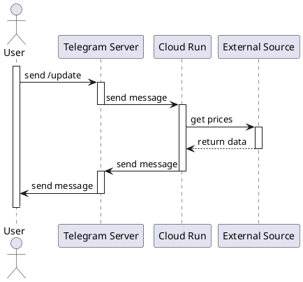

```plantuml

@startuml

skinparam shadowing false

actor User as u
participant "Telegram Server" as ts
participant "Cloud Run" as cr
participant "External Source" as es

activate u

u -> ts: send /update
activate ts

ts -> cr: send message
deactivate ts
activate cr

cr -> es: get prices
activate es

es --> cr: return data
deactivate es

cr -> ts: send message
deactivate cr
activate ts

ts -> u: send message
deactivate ts

u -[#ffffff]> u
deactivate u

@enduml

```
